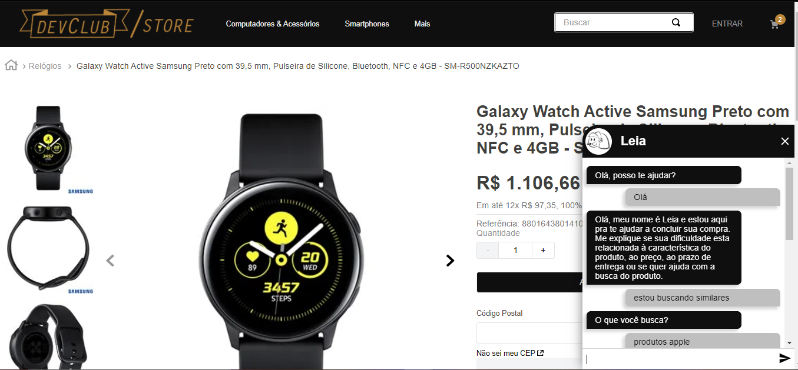
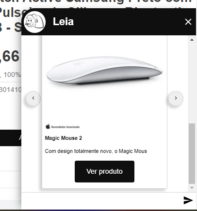
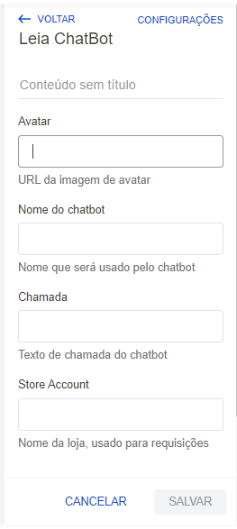

Acesse a loja de exemplo rodando [Leia Chatbot](https://hiringcoders3.vtexcommercestable.com.br/galaxy-watch-active-samsung-preto-com-395-mm-pulseira-de-silicone-bluetooth-nfc-e-4gb-sm-r500nzkazto/p).

## Leia chatbot

Leia chatbot é um robô desenvolvido para o ecossistema Vtex io.
No momento da detecção de abandono de compra o chatbot interagi com o usuário, tentando converter a visita do cliente em uma compra.

O chatbot Leia está disponível para instalação em qualquer tema Vtex.

### USABILIDADE

O bot torna-se ativo de duas formas:
1. Por meio do hover sobre o seu header.
2. Por meio da saida do cursor pelo topo da página.

O bot pode ser fechado clicando no X. Esse procedimento limpa o histórico da conversa.

### FEATURES

1. Foi desenvolvido um sistema de ui próprio para a comunicação com o sistema lex da AWS. Por meio disso possibilitamos a visualização de responseCards dentro do chat.
2. O bot percebe o contexto de produto de onde está sendo consultado possibilitando melhores indicações.

### CUSTOMIZAÇÃO

Leia chatbot é plug and play!
Basta instalar em seu tema e fazer preencher os dados na sessão de administrador da loja.

1. URL da imagem de avatar
2. Nome que será usado pelo chatbot
3. Texto de chamada do chatbot
4. Nome da loja, usado para requisições

### DEVCLUB

Esse projeto foi desenvolvido pela equipe DevClub para o desafio hiring Coders Vtex promovido pela Gama Academy.

